# **Know It**

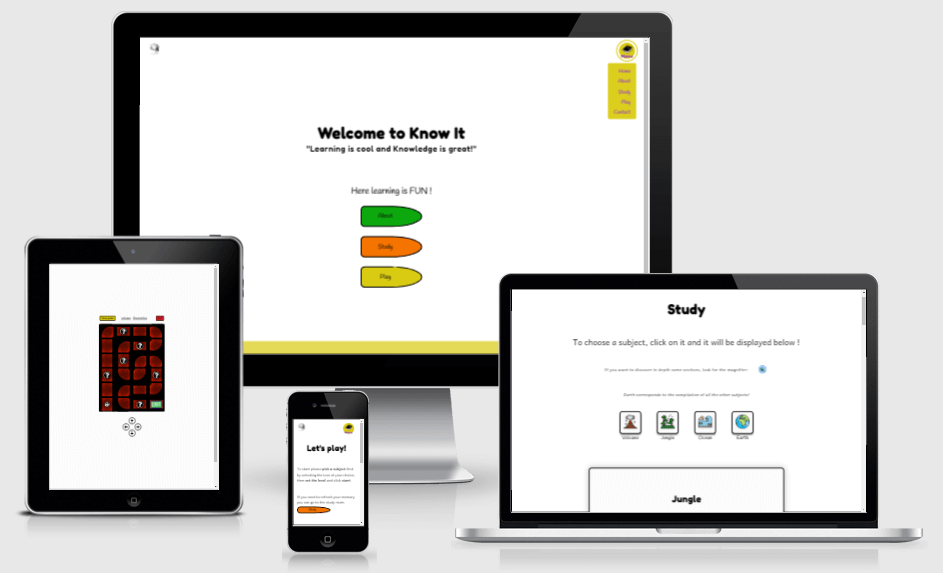

Check out the other mockups:

* [Home page](assets/images/README-images/mockups/ami-responsive-home.png)
* [About page](assets/images/README-images/mockups/ami-responsive-about.png)
* [Study page](assets/images/README-images/mockups/ami-responsive-study.png)
* [Play page](assets/images/README-images/mockups/ami-responsive-play.png)
* [Game interface](assets/images/README-images/mockups/ami-responsive-game-interface.png)
* [Gameplay](assets/images/README-images/mockups/ami-responsive-gameplay.png)
* [Contact page](assets/images/README-images/mockups/ami-responsive-contact.png)
* [404 page](assets/images/README-images/mockups/ami-responsive-404.png)

#### Visit the live Website : **[Know It :arrow_right:](https://tom-nagy.github.io/know-it/)**.

**Know It** is a learning application that promotes curiosity and enjoyment in the process of acquiring knowledge. Its motto is: “Learning is cool and knowledge is great!”.
**Know It** is based on the fact that learning is easier when it is fun and entertaining; and we have fun when we play! The website proposes two platforms: a game and and study environment. Both are linked and related in their content; meaning that you can learn everything you need (and more!) to succeed and complete the game in the study environment.  
Different exciting and very cool topics are being treated. They all refer to the general and worldwide curriculum of children education, they appeal to everyone and reach the maximum of communities. The content is based on the syllabus of children between the age of 12 and 15 years old. At this stage of life knowledge is bursting, interesting and exciting. Children are learning about the World and how it functions.
It is the fundamentals and the foundation of the “grown up” knowledge. In this spirit it will attract many people from the young adolescence to no limit!

The subjects of the starting version of the application are all about the cool things that everyone is excited about:

* Volcano
* Ocean
* Jungle
* The Earth

The Earth is the compilation of all the other subjects treated.  
They are amazing, entertaining, interesting and will be presented in the study environment in different sections as follow:

* Generals facts and Definitions
* How does it work?
* Interesting Facts!
* Scientific terms.

The game where the users will test their knowledge is a Labyrinth. Labyrinth are mesmerizing, intriguing and playful! That's why it is the perfect game to combine everything in an interactive and fun way.

## Table of Content

* [Project]("#Project)
  * [Project Goals](#Project-Goals)
  * [Developer and Business Goals](#Developer-and-Business-Goals)
  * [User Goals](#User-Goals)
* [UX](#UX)
  * [Audience Definition](#Audience-Definition)
  * [User Stories](#User-Stories)
  * [Design Choices](#Design-Choices)
  * [Wireframes](#Wireframes)
  * [Different Design](#Different-Design)
* [Features](#Features)
  * [Existing Features](#Existing-Features)
  * [Features to Implement in the Future Versions](#Features-to-Implement-in-the-Future-Versions)
* [Technologies Used](#Technologies-Used)
* [Testing](#Testing)
* [Deployment](#Deployment)
  * [Live Deployment](#Live-Deployment)
  * [Local Deployment](#Local-Deployment)
* [Bugs](#Bugs)
  * [Solved](#Solved)
  * [Unsolved](#Unsolved)
* [Credits](#Credits)
  * [Content](#Content)
  * [Media](#Media)
  * [Acknowledgements](#Aknowledgements)
  
## Project

### Project Goals

Know It encourage the **development of knowledge** and **understanding** of the different characteristics and features of the World.

It promotes curiosity and enjoyment in the process of learning for building lasting interest.  
It is and educational platform that makes learning cool and knowledge great!

### Developer and Business Goals

* Develop an interactive website using HTML, CSS and JavaScript.
* Bring knowledge to the Users.
* Make learning fun.
* Teach environmental awareness.
* Entertain.
* Impact a broad range of Users.
* Grow “Know It” culture and brand awareness.
* Be consider for and/or as a permanent tool in schools curriculum and other institutions.

### User Goals

* Learn about different subjects.
* Apply knowledge to challenges.
* Use Technology to improve skills set.
* Play a game.
* Solve Problems.
* Improve and have fun.
* Demonstrate knowledge.

[**:back:** *Table of Content*](#Table-of-Content)

## UX

### **Audience Definition**

The targeted audience is international with an age range of 11 or 12 years old to 15 or 16 years old and above. This audience is either children, or adults that are interested in science, environment and knowledge in general. It is as well children that have to study or learn about a subject and want to improve.

#### The targeted audience for this website is looking for :

* Learning.
* Improving their knowledge.
* Having a good grade.
* Checking on some information.
* A challenge.
* Having fun.
* Playing.

#### This website is the best way to answer their needs because :

* It provides information on different subjects.
* It matches children's curriculum and syllabus.
* It follows the best learning practice.
* It displays the content interactively.
* It gives an enjoyable learning experience.
* It provides useful links on how improving learning and studying skills.
* It proposes a game to test and reinforce knowledge.
* It proposes different level of difficulties for progression and challenge.
* It presents some feedback to the users for encouraging them to pursue their learning and improving.
* It rewards users by displaying achievements icons upon completing levels without mistakes.
* It gives a challenge to the users.

[**:back:** *Table of Content*](#Table-of-Content)

### **User Stories**

Users between 11 and 16 years old and older users are treated as the same because the only difference would be that the younger audience might have to learn what is provided by the application for grades and schools reasons; while the older audience would not have this imperative. This does not affect the users stories significantly to be treated separately.

**As a first time user, I want:**

1. The website to be appealing.
2. The navigation to be easy and intuitive.
3. The content to be informative but not overwhelming.
4. To understand immediately what is the website about without the need of looking for it.
5. To be able to choose the subject to study.
6. The content to be interactive.
7. To play the game.
8. The gameplay to be easy to understand.
9. To be able to choose a difficulty level for the game.
10. To be able to choose the subject of the game.
11. To keep tract of my gaming score and progress.

**As a returning user, I want:**

1. To improve.
2. To check the different subjects.
3. Challenge myself on the game.
4. Earn different achievements playing the game.
5. To contact and get information on the website owner.

[**:back:** *Table of Content*](#Table-of-Content)

### **Design Choices**

#### Fonts

In accordance with the developer/business goals and targeted audience, the fonts chosen for the websites are **Fredoka One**, **Handlee** and **Andika New Basic**.  

* Fredoka One will be used for headings. It is *display* font with a fun rounded style that matches perfectly with the website feel.  
* The Handlee is a *handwriting* font and will be used for the about page because it provides an informal and friendly display with a playful feel. This will bring a welcoming atmosphere to the page.

> Handlee is a great font for any web page looking to add some personality and charisma. There was careful attention to detail in removing unnecessary overlap between letters, which allows Handlee to be scaled down to very small sizes while still maintaining legibility.  
>[Handlee Google Fonts](https://fonts.google.com/specimen/Handlee?query=handl#glyphs).

* Andika New Basic is a *sans serif* font designed for literacy use. That makes it the perfect font to present and display the content on the website.  

The fonts selected for this project have clear and defined shapes to support learning. They are not aggressive and provide a general friendly feel.

#### Icons

* FontAwesome icons :  
They are used for better user experience mostly in the game for identifying the questions cases on the labyrinth.

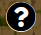

As well, achievements icons that users obtain as a reward upon finishing a level with no mistakes.

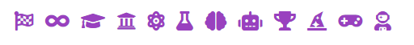

As well, they are used in the study page as a magnifier button to toggle more information.

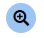

* Icons are used to have a visual and easy way to recognize the subjects treated on the website.

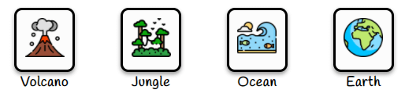

* The **logo** and **[favicon](assets/images/favicon/favicon.ico)** are the same image to follow best practice and consistency.


#### Colors

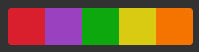

The colours chosen for the website are bright and joyful. They are based on the psychology behind colours ([colour affects](http://www.colour-affects.co.uk/psychological-properties-of-colours), [London Image Institute](https://londonimageinstitute.com/how-to-empower-yourself-with-color-psychology/)). I used [Adobe Color](https://color.adobe.com/create/color-wheel) to create the colour scheme.

* Yellow for creativity and happiness.
* Orange for sociability and fun.
* Green for quality and growth.
* Purple for wisdom.

A blue will be used for displaying extra content as reference to competence and depth.
white will be used as background colour for cleanliness and simplicity.

The swatches are said to be color-blind safe by Adobe Color [accessibility tool](https://color.adobe.com/create/color-accessibility).


#### Images

Images will be used for illustration purposes. They will help the representation of information in the study page of the website and are composed of pictures, drawings, schema and diagrams.

As well images are used to create the labyrinth paths. They correspond to the subject selected for consistency and visual cues.

| Volcano | Jungle | Ocean | Earth |
| :-----: | :----: | :---: | :---: |
| 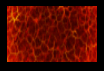 | 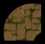 |  | 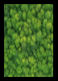 |

#### Styling and Feeling

The website is a learning platform that includes some content and a game.  
It uses bright and simple colours to provide the feeling of easy accessibility.  
It presents a clean, playful, welcoming and trustworthy feel in order to bring quality information in a fun way!

[**:back:** *Table of Content*](#Table-of-Content)

### **Wireframes**

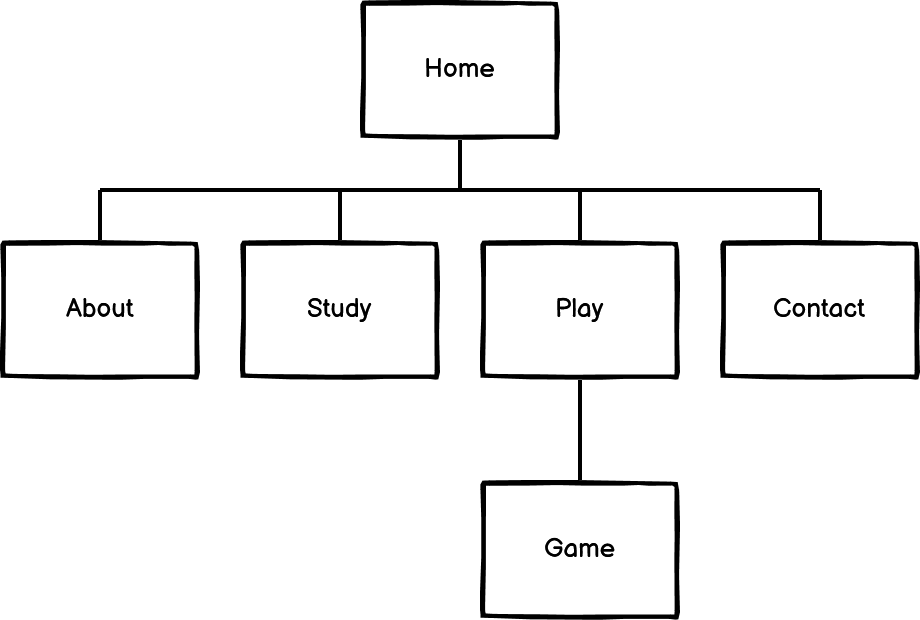

* [Site Map](assets/wireframes/site-map.pdf)
* [Home](assets/wireframes/home.pdf)
* [About](assets/wireframes/about.pdf)
* [Study](assets/wireframes/study.pdf)
* [Play](assets/wireframes/play.pdf)
* [Game](assets/wireframes/game.pdf)
* [Contact](assets/wireframes/contact.pdf)
* [404 error](assets/wireframes/404-error.pdf)

For the full version:

* [Know It](assets/wireframes/know-it.pdf)

### **Different Design**

Some designs are different from the wireframes because of user experience compliance, accessibility and time.  

#### The Icon/Menu :

The logo was supposes to be the menu as well and the menu would have displayed when hovering or clicking on it.  
I realized that it was not relevant for this website and it would not benefit the user experience in any way and at the contrary, it would have made the navigation difficult.
The logo and and the menu are two different icons now and have their own functionality that correspond to the best practice.

#### The Carousel in play.html :

A carousel was supposed to be used in order to display the subjects in play.html. This was not implemented because of time constraints.  
It does not impact negatively the user experience and will be part of the features to implement in the future.

#### The link in 404.html

The reason input field will not be pre-populated when clicking on `report an issue`. This was not implemented because it needs exporting and importing data from different files and I was adviced not to do it because of the need of compilers to be installed.

[**:back:** *Table of Content*](#Table-of-Content)

## Features

The navigation menu is purposely “hidden” for focus reasons. I have made the choice to present it as a button that will toggle the different links in order to prevent visual interferences.  
This provides a cleaner and less busy viewport for the users. The goal being to avoid distractions.  
It is clearly recognizable by its position (top right) and the icon that defines it contains the word menu.  

All the main pages are accessible by a visual link presented as an arrow sign situated at a relevant position on the page without the need of clicking on the menu icon.

The contact page is reachable from about page or the dropdown menu.  
It is intended not to be as obvious as the rest of the website because the main website audience is students and the website primary goal is about learning and playing, not being contacted.  
The contact page is mostly intended for teachers, schools, institution, business etc; that would want to reach out.

### **Existing Features**

#### Repeated Features

The **navigation bar** and the **footer** are present on all the pages except when the game is being played.

* The navigation bar:  
  * There is the website logo on the left that is linked to the home page for best practice.
  * The navigation menu is displayed as a toggle on all screen sizes in order to keep a clean visual and distractions to the minimum.

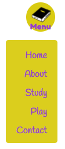

* The Footer:
  * On the left it displays the “copyright” *For educational use*.
  * On the right it displays some external links giving information and tips on study and learning technics.

#### Home

The home page is composed of the main title: “**Welcome to Know It**” and a subtitle: “*Learning is fun and knowledge is great*”. As well, it displays a statement: Here learning is FUN!”. This welcome and invites users to discover the website and set the mood and feel of the website.  

It presents three buttons that link to the corresponding page:

* About
* Study
* Play

It corresponds to three choices that represent the main content of the website.

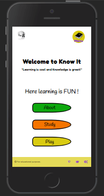

#### About

The about page gives a description of the website goals and features.  
It invites users to discover the website with two main buttons:

* Study
* Play

As well a paragraph offers users to reach out to the website owner with a secondary button:

* Contact

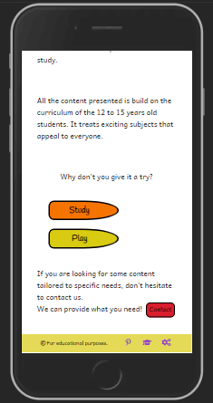

#### Study

This page presents some learning content.  
It is composed of a title to identify clearly the page the user is on. There are as well explanation on how to proceed: “To choose a subject, click on it!”; and it presents a feature of the page inviting users to look for magnifiers in order to discover more information about a section.  

Four icons are displayed and represent the subject available to study. The fourth one being the compiled version of the other ones:

* Volcano
* Jungle
* Ocean
* Earth

The volcano subject will be displayed by default.

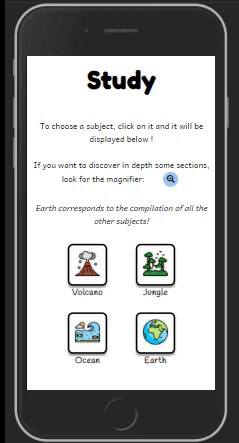

At the bottom of the page and at the end of the articles a link to the play page is displayed and text invites users to test their knowledge by playing the game.

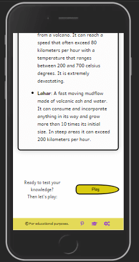

#### Play

The page presents a title inviting to play: “Let's play!”.  
As well is displayed the steps to follow in order to set up a party.  
There is an invitation to go to the study room in order to refresh our memory with a link to the corresponding page.  
There is a *How to play?* button that triggers a pop-up with the rules and more precise information on the game.

The interface to set up the party is composed of a **dropdown menu** to set the level, a **carousel** to display the subject's icons on one line and a button: “**Play**” to start the game. This protocol provide users an overview of the settings and choices made before to start to play.

The game settings are composed of:

* A **subjects** section that displays the available subjects to select from.
* A **dropdown menu** to set the level.
* A **Start** button to play the game.

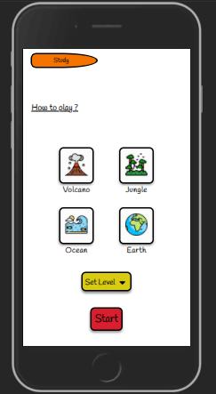

As well, not visible when just starting to play, a section at the bottom of the page is set to display achievements when getting them. It is intentionally not given any title or visible separation in order to keep this as a surprise. It provides users positive feedback and rewards upon finishing and completing levels with no mistakes.

#### Game

The game interface is composed of:

* The game area in the middle → the labyrinth.
* The control buttons on the bottom. They are four directional arrows.
* A New game button on the top left to start a new game with the same settings as the one being played.
* An Exit button on the top right to go back to the “main” play page.
* The subject being played on the top middle left.
* The difficulty level being played on the top middle right.

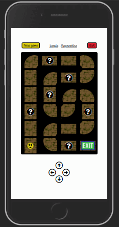

The gameplay is as follow:  
You will move the avatar through the labyrinth in order to reach the exit. The access to the exit is blocked and in order progress through the labyrinth you will need to answer some questions.  
Once you reached the question mark, you will have to answer a multiple choices question.  
If you get it right your passage will be granted.  
If you get it wrong you will get a strike, but you will be able to progress.  
The number of strikes allowed are determined by the level difficulty of the party.  
The questions appear as pop-up. There you will have to select one answer and validate your answer.
Will you be able to get out?

#### Contact

The contact page is very simple and offer users a way to reach out to the website owner.  
EmailJS has been implemented and allows the management of emails without needing the server side. It has been set to send an automatic email back to the user for better user experience.

There are four fields to fill up:

* Your name: → Who the person is.
* Email address: → To be answered back.
* Reason: → Dropdown menu to select from different options.
* Tell us more: → A textarea to provide additional information.
* A send button is displayed as well to send the form.  

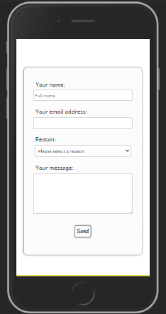

Upon sending, a pop-up will give feedback to the user thanking him for the message. It will provide as well links to different pages of the website: Home, Study and Play in order to provide the main navigation links for better user experience.  
A similar feature will display if the form fail to send.


#### 404 error

A custom page will handle the “404 error” by displaying a message explaining the error.  
It provides a button to go back to the home page and some useful links.

* A link that will bring the user to a website that explain what is a 404 error.
* A link that bring the user to the contact page to report an issue.

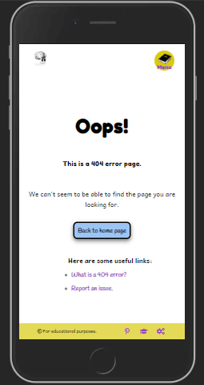

[**:back:** *Table of Content*](#Table-of-Content)

### **Features to Implement in the Future Versions**

 On a general note, adding other subjects to play and study.

#### play.html

Create a carousel to display the subjects available to play on one line only for space management and better user experience. This would be helpful for future website maintenance and expansion because it will always take the same real estate on the page.

In pair with the study page, pre-select the subject that was played when clicking on the `Study`, so the same subject is displayed.

##### play.html ⇾ game

Add Different rewards. Extra rewards earned when combining achievements.

Create a toggle button named `Achievements` that would display the achievements.

Add the otpion to create a profile to be able to store information on different browsers and devices.  
Add the option to display rewards icon on profile picture.

#### study.html

Add carousels in the different articles to support the representation of the subject being treated.  This could be presented as a tab on top of the article, so the user would be able to choose between “Article” and “Gallery”.

In pair with the play page, pre-select the subject that was studied when clicking on the `Play`, so the same subject is pre-selected.

#### 404.html

Pre-populate the reason input field in the contact form upon clicking the link to report an issue.

[**:back:** *Table of Content*](#Table-of-Content)

# Technologies Used 

### Programing Languages

This project uses HTML, CSS and JavaScript.

### Frameworks, Libraries and Programs

* [Balsamiq](https://balsamiq.com/wireframes/)  
For creating wireframes.

* [Google Fonts](https://fonts.google.com/)  
For importing fonts (**Fredoka One**, **Handlee** and **Andika New Basic**) into the style.css file.

* [Font Awesome](https://fontawesome.com/icons?d=gallery)  
For using icons throughout the website.

* [favicon.io](https://favicon.io/favicon-converter/)  
For generating the favicon.

* [TinyPNG](https://tinypng.com/) or [Squoosh](https://squoosh.app/)  
For resizing all the images.

* [BeFunky](https://www.befunky.com/create/)
For cropping some images.

* [Adobe Color](https://color.adobe.com/create/image)  
For extracting the color scheme used on the website.

* [Am I Responsive?](http://ami.responsivedesign.is/?url=http://ami.responsivedesign.is/#)  
For providing screenshots of the responsiveness of the website across several devices.

* [Autoprefixer CSS online](https://autoprefixer.github.io/)  
For adding prefixer for cross browser compatibility.

* [EmailJs](https://www.emailjs.com/)  
For email service implementation using API and without server.

* [Git](https://git-scm.com/)  
For Version control.

* [GitPod](https://www.gitpod.io/)  
For Integrated Development Environment.

* [GitHub](https://github.com/)  
For storing the repository.

* [GitHub Pages](https://pages.github.com/)  
For deploying the website live.

[**:back:** *Table of Content*](#Table-of-Content)

## Deployment

This project was developed on [GitPod Workspaces IDE](https://gitpod.io/workspaces/) (Integrated Development Environment) committed and pushed to my [GitHub Repository](https://github.com/Tom-Nagy/know-it) using GitPod Command Line Interface (CLI).

## Live Deployment

To make this website accessible to the public, Walking Around has been deployed on [GitHub Pages](https://pages.github.com/) as follow :

1. Log in to my GitHub account.
    * To create an account you need to sign up on [GitHub](https://github.com/).
2. Go to my **Repositories** and select the repository corresponding : [Know It](https://github.com/Tom-Nagy/know-it).
    * To create a repository see [Create a repo](https://docs.github.com/en/github/getting-started-with-github/create-a-repo).
3. Navigate to **Settings** :


4. Scroll down to the **GitHub Pages** section.
5. Click on the link to go to the dedicated tab :

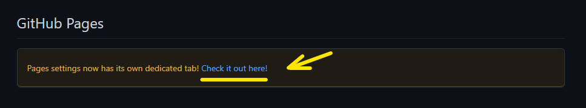

6. Click on the **None** dropdown menu and select the branch to publish : **master**.


7. Click on **Save**.
8. The website is now deployed.

The link to the website is found in the **GitHub Pages** section of the repository settings.


[**:back:** *Table of Content*](#Table-of-Content)

## Local Deployment

### Cloning

When a repository is created on GitHub, it is located on GitHub website (“remotely”). You can create a copy of the repository locally on your machine. This process is called : “**Cloning a repository**”.  
When cloning a repository you are actually copying all the data that the repository contains at that time to your machine.

To clone a repository, take the following steps :

1. Create a GitHub account.
2. Click on the **Code** dropdown button above the files list.
3. There are three options available to clone the repository :
    * using HTTPS
    * using SSH key
    * using GitHub CLI  


4. Choose an option and copy the link given.
5. Change the current working directory to the location where you want the cloned directory.
6. Open your IDE and in the CLI type : ```git clone``` and paste the link copied on step 4.

>```$ git clone https://github.com/YOUR-USERNAME/YOUR-REPOSITORY```

7. Press **Enter** to create your local clone.

For further information please go to [Cloning a repository](https://docs.github.com/en/github/creating-cloning-and-archiving-repositories/cloning-a-repository#cloning-a-repository-using-the-command-line).

### Using GitPod

To Clone a repository Using GitPod, take the following steps :

1. Create a GitHub account.
2. Install the GitPod [extension](https://chrome.google.com/webstore/detail/gitpod-dev-environments-i/dodmmooeoklaejobgleioelladacbeki) for Chrome or [Add-on](https://addons.mozilla.org/en-GB/firefox/addon/gitpod/) for Firefox.
3. Navigate to the corresponding repository.
4. Click on the **GitPod** button on the top right of the files list.
5. This will open a workspace on GitPod where you can work on the repository locally.

>The very first time that you do this, you need to connect GitPod and GitHub together. You need to log in with GitHub and launch your workspace (As explain above). And then you need to authorize GitPod to be able to access your GitHub account. You agree to GitPod's terms and conditions, and then create a free account. Then, it will open the workspace for you.
Quote from : “Creating a GitPod Workspace” on [Code Institute Full Stack Software Development Programme](https://codeinstitute.net/full-stack-software-development-diploma/), by Matt Rudge.

### Using GitHub Desktop

Another option is available : GitHub Desktop. It consists of cloning a repository from GitHub to GitHub Desktop.  
For full information about how to use this option, please visit [GitHub Docs](https://docs.github.com/en/desktop/contributing-and-collaborating-using-github-desktop/cloning-a-repository-from-github-to-github-desktop).

### Forking

Forking a repository will copy it in your own repositories in GitHub.

>A fork is a personal copy of another user's repository that lives on your account. Forks allow you to freely make changes to a project without affecting the original upstream repository. You can also open a pull request in the upstream repository and keep your fork synced with the latest changes since both repositories are still connected.

To Fork a repository take the following steps :

1. Create a GitHub account.
2. Navigate to the corresponding repository.
3. Identify the ```fork``` button on the top right of the page and click on it.


4. Now you should find a copy of the repository in ```Your repositories```.

[**:back:** *Table of Content*](#Table-of-Content)

## Testing

Testing information are published in a separate file : [TESTING.md](TESTING.md)

## Bugs

### Solved

Issue : when submitting an answer in the game it repeats the event that is listening for it by the number of time we have submitted an answer. For example if we are answwering the fourth question, it will read it the event four times and it should be done once only.  
Solve : I have added a third parameter to the event listener so it happens only once. `{once: true}`

Issue : When exiting the game, if the user click start a game with (or whithout) selecting a different subject, the previous game resume instead of starting from new.  
Solve : Create a function (`setGameParameters()`) that is called when the start button is click and set the position of the avatar to the starting place.

Issue : The rewards/achievements don't appear in the results when finishing the game with no strikes and they don't appear neither on play.html.  
Solve : Changed the approach as I was using the `append()` method and it didn't give the result I was expecting. So I have created all the rewards that are icons in play.html and for displaying them I used a class `hide` that has the `display="none"`. Then I toggled this class with JavaScript when relevant.

Issue : The selection of random questions with no repeat doesn't work. The function is called each time we are on a question and the indexes of the questions for the game in progress is reset. The array containing the indexes should be store outside of the function to keep track of what has been asked.  
Solve : An array was created at the top level so it can be accessible from any functions. Then when the game start, a function is called to populate the array with the corresponding questions indexes depending on the subject and level. This array is set to empty when starting a new party and before to be populated.

Issue : From one question to another in the game, the radio button is checked at the same position as the previous question.  
Solve : Add an if statement that reset the button that is checked before displaying the question.

Issue : On smartphones when double-click on the directional button, it zooms. This doesn't prevent users from playing, but it doesn't give a good user experience.  
Solve : Add `touch-action: manipulation` in style.css to prevent the double click.

Issue : When starting the game for the first time, and when answering the first question by clicking on the `Let's check!` button it quits the game ang goes back to play.html. It looks like the page is reloading.  
Solve : Add the `.preventDefault()` method when submitting the form to prevent the default GET method.

Solve: General solve for reoccurring bugs. The scripts tags for linking the JavaScript files were not placed properly in the HTML files. So i moved them from after to before the `</body>`.

Issue : Some content is displayed outside the viewport and is not being centered anymore.
Solve : Remove `display: -webkit-box` in style.css.

### Unsolved

Issue : On iOS, the menu icon is not rendering properly rendering.

Issue : On iOS, the button to close modal doesn't render nicely.

Issue : On iOS, the directional buttons hover and/or focus effect don't render properly. this does not prevent users from playing, but it takes away from the user experience.


[**:back:** *Table of Content*](#Table-of-Content)

## Credit

**All the written subject's content provided on the website is the result of my research and are my own production.**  
Some resources used are but not limited to:

* [lelivrescolaire.fr](https://www.lelivrescolaire.fr/matiere/sciences-de-la-vie-et-de-la-terre)
* [Owlcation](https://owlcation.com/)
* [Kiddle](https://www.kiddle.co/)
* [NATIONAL GEOGRAPHIC](https://www.nationalgeographic.org/)
* [NATIONAL GEOGRAPHIC KIDS](https://www.natgeokids.com/ie/)
* [MONGABAY](https://rainforests.mongabay.com/)
* [Britannica](https://www.britannica.com/)
* [National Oceanic and Atmospheric Administration: NOOA](https://www.noaa.gov/)
* [USGS](https://www.usgs.gov/)
* [LIVESCIENCE](https://www.livescience.com/)
* [Wikipedia](https://www.wikipedia.org/)

### Content :

[W3schools](https://www.w3schools.com/)  
For general database on software development.

[favicon.io](https://favicon.io/favicon-converter/)  
For the converting the favicon and providing the links and explanation on how to install the favicon for the website.

[stack overflow](https://stackoverflow.com/questions/29650867/remove-part-of-string-in-javascript)  
For the explanation on how to create a substring without a fix index to start from using the indexOf() method.

[stack overflow](https://stackoverflow.com/questions/15192614/javascript-how-to-stop-a-random-number-from-appearing-twice)  
For the explanation on how to generate a random number and for that number not to appear twice.

[Ross Allen](https://stackoverflow.com/questions/10614481/disable-double-tap-zoom-option-in-browser-on-touch-devices)  
For explanation on how to disable double click on html elements.

### Media

##### External links :

[ScienceNewsforStudents](https://www.sciencenewsforstudents.org/article/top-10-tips-study-smarter-not-longer-study-skills)  
[FocusMe](https://focusme.com/blog/8-tips-to-study-better/)  
[Pinterest 10 Study Tips by Diamond](https://www.pinterest.ie/pin/184225440993206363/)  
[Wikipedia 404 error definition](https://en.wikipedia.org/wiki/HTTP_404)

##### Icons :

[Alexandr Martinov on Iconfinder](https://www.iconfinder.com/search/?q=book&price=free)  
For the menu icon that was slightly adjusted to the website needs using [Iconfinder Editor](https://www.iconfinder.com/editor/).

* Icon made by Freepik from [www.flaticon.com](www.flaticon.com):
  * [Volcano](https://www.flaticon.com/free-icon/volcano_2206644?term=volcano&page=1&position=3&page=1&position=3&related_id=2206644&origin=search)
  * [Jungle](https://www.flaticon.com/free-icon/volcano_2206644?term=volcano&page=1&position=3&page=1&position=3&related_id=2206644&origin=search)
  * [Ocean](https://www.flaticon.com/free-icon/ocean_3254422?term=ocean&page=1&position=8&page=1&position=8&related_id=3254422&origin=search)
  * [Earth](https://www.flaticon.com/free-icon/earth-globe_616616?term=earth&page=1&position=12&page=1&position=12&related_id=616616&origin=search)

##### Images :

* For the Volcano content:  
  * [Infographic vector created by brgfx - www.freepik.com<](https://www.freepik.com/vectors/infographic)  
  Images from [Adobe Stock](https://stock.adobe.com/ie/):  
  * [volcano and earthquake infographic vector by gritsalak](https://stock.adobe.com/ie/images/volcano-and-earthquake-infographic-vector/211375558?prev_url=detail)  
  * [volcano type. shield, dome, composite, and caldera by designua](https://stock.adobe.com/ie/images/volcano-type-shield-dome-composite-and-caldera/319892493?prev_url=detail)  
  * [Part of a volcano by blueringmedia](https://stock.adobe.com/ie/images/part-of-a-volcano/377249194?prev_url=detail)

* For the Ocean content:  
  * [Oceans map by our homework help](https://ourhomeworkhelp.wordpress.com/2016/07/11/map-of-continents-oceans/)  
  * [Image by brgfx from [freepik](https://www.freepik.com)](https://www.freepik.com/free-vector/tidal-movements-earth_1466597.htm#page=1&query=ocean%20tides&position=49)  
  * [Image by U.S. Geological Survey, Department of the Interior/USGS Howard Perlman, USGS and John Evans, USGS. from Kiddle](https://kids.kiddle.co/Image:Water_cycle.png)  
  * [Image by U.S. Geological Survey , Department of the Interior/USGS Igor Shiklamonov, 1993, "Water in Crisis: A Guide to the World's Freshwater Resources"](https://www.usgs.gov/media/images/distribution-water-and-above-earth)  

* For the Jungle content:
  Images from [Adobe Stock](https://stock.adobe.com/ie/):  
  * [Rainforest layers educational banner or poster. Jungle vertical structure educational scheme. Emergent, canopy, understory and floor levels. Flat vector illustration by Rudzhan](https://stock.adobe.com/ie/images/rainforest-layers-educational-banner-or-poster-jungle-vertical-structure-educational-scheme-emergent-canopy-understory-and-floor-levels-flat-vector-illustration/408770051?prev_url=detail&asset_id=408770051)  
  * [Aerial view of deforestation. Rainforest being removed to make way for palm oil and rubber plantations by whitcomberd](https://stock.adobe.com/ie/images/aerial-view-of-deforestation-rainforest-being-removed-to-make-way-for-palm-oil-and-rubber-plantations/240813889?prev_url=detail&asset_id=240813889)

* For the Labyrinth path images depending on the subject selected:
Images from [Adobe Stock](https://stock.adobe.com/ie/):
  * Volcano: [heat red cracked ground texture after eruption volcano by releon8211](https://stock.adobe.com/ie/images/heat-red-cracked-ground-texture-after-eruption-volcano/110818846?prev_url=detail), 
  * Jungle: [Yellow brick wall seamless texture for jungle theme vector by Pallavi](https://stock.adobe.com/ie/images/yellow-brick-wall-seamless-texture-for-jungle-theme-vector/271949380?prev_url=detail),
  * Ocean: [blue water wave texture background by Naoki Kim](https://stock.adobe.com/ie/images/blue-water-wave-texture-background/154153098?prev_url=detail),
  * Earth: [Top view of a young green forest in spring or summer by artjazz](https://stock.adobe.com/ie/images/top-view-of-a-young-green-forest-in-spring-or-summer/207714693?prev_url=detail)

* For the exit sign in the labyrinth :
[Arrow vector created by freepik - www.freepik.com](https://www.freepik.com/vectors/arrow)

### Aknowledgements :

Special thanks to all Code Institute's team (“Teacher”, Lecturers and Tutors) that are making me more knowledgeable and are making this happen.

Huge thank you to the [Slack](code-institute-room.slack.com) community, all the members and all the leads and tutors for their help and support.

I am hugely grateful to my mentor Chris Quinn for guiding me through this project.

[**:back:** *Table of Content*](#Table-of-Content)