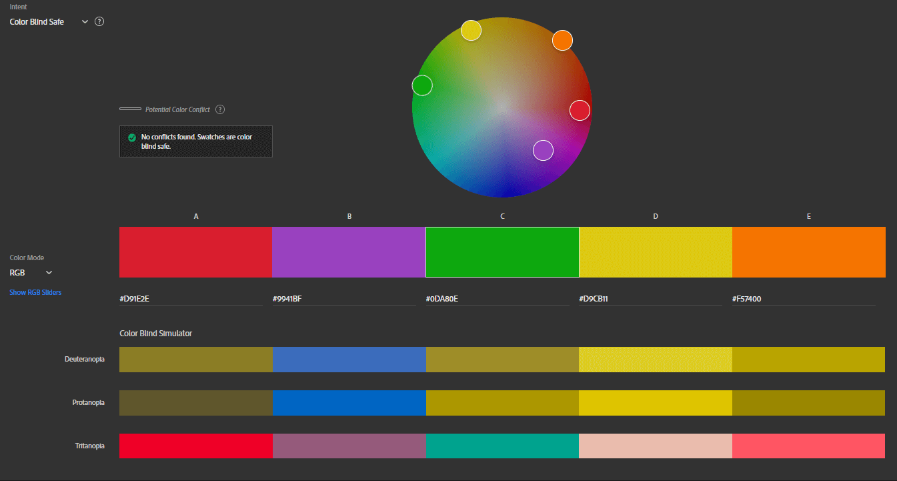
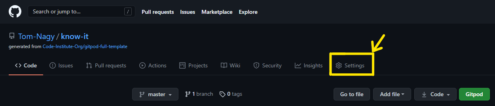
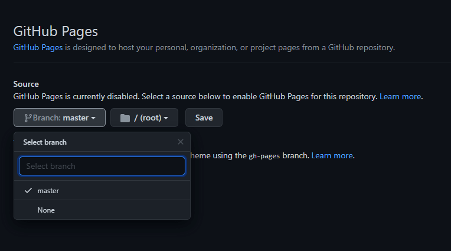
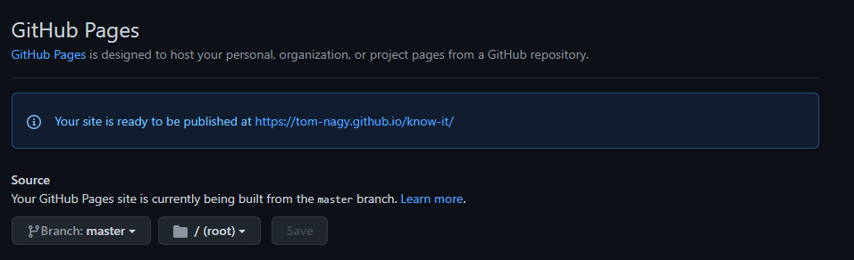
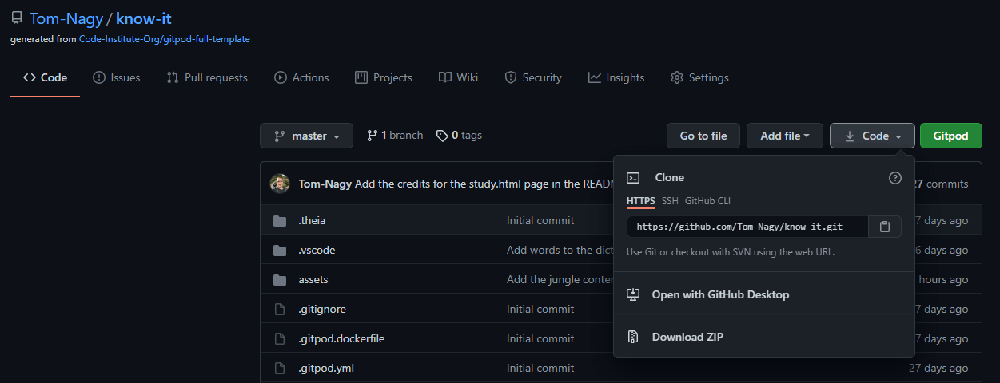
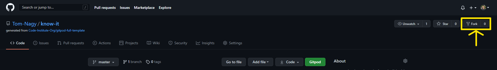

# **Know It**


Check out the other mockups:

* ["PAGE NAME"](assets/images/README-images/mockup/ami-responsive-"PAGE NAME".png)
* ["PAGE NAME"](assets/images/README-images/mockup/ami-responsive-"PAGE NAME".png)
* ["PAGE NAME"](assets/images/README-images/mockup/ami-responsive-"PAGE NAME".png)
* ["PAGE NAME"](assets/images/README-images/mockup/ami-responsive-"PAGE NAME".png)
* ["PAGE NAME"](assets/images/README-images/mockup/ami-responsive-"PAGE NAME".png)

#### Visit the live Website : **[Know It :arrow_right:]("WEBSITE LINK")**.

Know It is a learning application that promote curiosity and enjoyment in the process of acquiring knowledge. Its motto is: “Learning is cool and knowledge is great!”.
Know It is based on the fact that learning is easier when it is fun and entertaining; and we have fun when we play! The website proposes two platforms: a game and and study environment. They both are linked and related in their content, meaning that you can learn everything you need (and more!) to succeed and complete the game in the study environment.  
Different exciting and very cool topics are being treated. They all refer to the general and worldwide curriculum of children education, they appeal to everyone and reach the maximum of communities. The content is based on the syllabus of children between the age of 12 and 15 years old. At this stage of life knowledge is bursting, interesting and exciting. Children are learning about the World and how it functions.
It is the fundamentals and the foundation of the “grown up” knowledge. In this spirit it will attract many people from the young adolescence to no limit.
The application is published in English and will propose a French version as well (MAYBE).  
The subjects of the starting version of the application are all about the cool things that everyone is excited about:

* Volcano
* Ocean
* Jungle
* The Earth

The Earth is the compilation of all the subjects treated and more.  
They are amazing, entertaining, interesting and will be presented in the study environment in different sections as follow:

* Generals facts and Definitions
* How does it work?
* Fun Facts!
* Did you know ...

The game where the users will test their knowledge is a Labyrinth. Labyrinth are mesmerizing, intriguing and playful; that is why it is the perfect game to combine everything in an interactive and fun way.

## Table of Content

* [Project]("#Project)
  * [Project Goals](#Project-Goals)
  * [Developer and Business Goals](#Developer-and-Business-Goals)
  * [User Goals](#User-Goals)
* [UX](#UX)
  * [Audience Definition](#Audience-Definition)
  * [User Stories](#User-Stories)
  * [Design Choices](#Design-Choices)
  * [Wireframes](#Wireframes)
  * [Different Design](#Different-Design)
* [Features](#Features)
  * [Existing Features](#Existing-Features)
  * [Features to Implement in the Future Versions](#Features-to-Implement-in-the-Future-Versions)
* [Technologies Used](#Technologies-Used)
* [Testing](#Testing)
* [Deployment](#Deployment)
  * [Live Deployment](#Live-Deployment)
  * [Local Deployment](#Local-Deployment)
* [Bugs](#Bugs)
  * [Solved](#Solved)
  * [Unsolved](#Unsolved)
* [Credits](#Credits)
  * [Content](#Content)
  * [Media](#Media)
  * [Acknowledgements](#Aknowledgements)
  
## Project

### Project Goals

Know It encourage the **development of knowledge** and **understanding** of the different characteristics and features of the World.

It promotes curiosity and enjoyment in this process for building lasting interest.  
It is and educational platform that makes learning cool and knowledge great!

### Developer and Business Goals

* Develop an interactive website using HTML, CSS and JavaScript. 
* Bring knowledge to the Users.
* Make learning fun.
* Teach environmental awareness.
* Entertain.
* Impact a broad range of Users.
* Grow Know It culture and brand awareness (to attract more Users).
* Be consider for and/or as a permanent tool in schools curriculum.

### User Goals

* Learn about different subjects.
* Apply knowledge to challenges.
* Use Technology to improve skills set.
* Play a game.
* Solve Problems.
* Improve and have fun.
* Demonstrate knowledge.

[**:back:** *Table of Content*](#Table-of-Content)

## UX

### **Audience Definition**

The targeted audience is international with an age range of 11 or 12 years old to 15 or 16 years old and above. This audience is either children 
or adults that are interested in science, environment and knowledge in general. It is as well children that have to study or know about a subject 
and want to improve.

#### The targeted audience for this website is looking for :

* Learning.
* Improving their knowledge.
* Having a good grade.
* Checking on some information.
* A challenge.
* Having fun.
* Playing.

#### This website is the best way to answer their needs because :

* It provides information on different subjects.
* It matches children's curriculum and syllabus.
* It follows the best learning practice.
* It displays the content interactively.
* It gives and enjoyable learning experience.
* It provides useful links on some additional content.
* It provides useful links on how to learn and improving learning.
* It proposes a game to test and reinforce knowledge.
* It proposes different level of difficulties for progression and challenge.
* It presents some feedback to the users for encouraging them to pursue their learning and improving.

[**:back:** *Table of Content*](#Table-of-Content)

### **User Stories**

Users between 11 and 16 years old and older users are treated as the same because the only difference would be that the younger audience might have to learn what is provided by the application for grades and schools reasons while the older audience would not have this imperative. This does not affect the users stories significantly to be treated separately.

**As a first time user, I want:**

1. The website to be appealing.
2. The navigation to be easy and intuitive.
3. The content to be informative but not overwhelming.
4. To understand immediately what is the website about without the need of looking for it.
5. To be able to choose the subject to study.
6. The content to be interactive.
7. To play the game.
8. The gameplay to be easy to understand.
9. To be able to choose a difficulty level for the game.
10. To be able to choose the subject of the game.
11. To create a profile to keep tract of my gaming score and progress.

**As a returning user, I want:**

1. To improve.
2. To check the different subjects.
3. Challenge myself on the game.
4. Earn different medals and success regarding my game score.
5. To check out additional content or information.
6. To contact and get information on the website owner.

[**:back:** *Table of Content*](#Table-of-Content)

### **Design Choices**

#### Fonts

In accordance with the developer/business goals and targeted audience, the fonts chosen for the websites are **Fredoka One**, **Handlee** and **Andika New Basic**.  
Fredoka One will b used for headings. It is *display* font with a fun rounded style that matches perfectly with the website feel.  
The Handlee is a *handwriting* font and will be used for the home page because it provides an informal and friendly display with a playful feel. This will bring a welcoming atmosphere to the home page.
> Handlee is a great font for any web page looking to add some personality and charisma. There was careful attention to detail in removing unnecessary overlap between letters, which allows Handlee to be scaled down to very small sizes while still maintaining legibility.  
>[Handlee Google Fonts](https://fonts.google.com/specimen/Handlee?query=handl#glyphs).  
Andika New Basic is a *sans serif* font designed for literacy use. That makes it the perfect font to present and display the content on the website.  

The fonts selected for this project have clear and defined shapes to support learning. They are not aggressive and provide a general friendly feel.

#### Icons

>"CHECK AND DOUBLE-CHECK THE LINKS..... ADD AND ADAPT THE CONTENT ...."

* FontAwesome icons will be used for better user experience.
* The logo and [favicon](assets/images/favicon/favicon.ico) are the same image to follow best practice and consistency.


#### Colors


The colours chosen for the website are bright and joyful. They are based on the psychology behind colours ([colour affects](http://www.colour-affects.co.uk/psychological-properties-of-colours), [London Image Institute](https://londonimageinstitute.com/how-to-empower-yourself-with-color-psychology/)). I used [Adobe Color](https://color.adobe.com/create/color-wheel) to create the colour scheme.

* Yellow for creativity and happiness.
* Orange for sociability and fun.
* Blue for peace and competence.
* As well white will be used for cleanliness and simplicity.

The swatches are said to be color-blind safe by Adobe Color [accessibility tool](https://color.adobe.com/create/color-accessibility).



#### Images

Images will be used for illustration purposes. They will help the representation of information in the study page of the website and are composed of pictures, drawings, schema and diagrams.

#### Styling and Feeling

The website is a learning platform that includes some content and a game. It uses bright and simple colours to provide the feeling of easy accessibility. It presents a clean, welcoming and trustworthy feel in order to bring quality information in a fun way!

[**:back:** *Table of Content*](#Table-of-Content)

### **Wireframes**

* [Desktop](assets/wireframes/"desktop".pdf)
* [Tablet](assets/wireframes/tablet.pdf)
* [Mobile](assets/wireframes/mobile.pdf)

"THEY CAN BE DONE AS WELL PER PAGES COMPARING THE LOOK OF THE PAGE ON DIFFERENT SCREENS AT ONCE."

### **Different Design**

"IF THE LIVE WEBSITE IS DIFFERENT FROM THE WIREFRAMES"
Some designs are different from the wireframes because of user experience compliance, accessibility, technical skills and time.  

#### Site Map

"STRUCTURE OF THE WEBSITE IS DIFFERENT IN THIS AND THAT WAY BECAUSE ...."

#### Footer

* 
* 

#### Home

*  
*  

[**:back:** *Table of Content*](#Table-of-Content)

## Features

### **Existing Features**

#### Repeated Features

On all pages and devices there is ........

**FEATURE** DESCRIPTION OF THE FEATURE

**FEATURE** DESCRIPTION OF THE FEATURE 

All pages feature .... SOMETHING FOR THIS PURPOSE ....

#### Home

DESCRIPTION OF THE FEATURE

#### PAGE NAME

DESCRIPTION OF THE FEATURE

#### PAGE NAME

DESCRIPTION OF THE FEATURE

[**:back:** *Table of Content*](#Table-of-Content)

### **Features to Implement in the Future Versions**

#### PAGE NAME

FEATURES TO BE ADDED
CHANGES TO BE DONE

#### PAGE NAME

FEATURES TO BE ADDED
CHANGES TO BE DONE


#### Additional page

FEATURES TO BE ADDED

[**:back:** *Table of Content*](#Table-of-Content)

# Technologies Used 

### Programing Languages

This project uses ...

### Frameworks, Libraries and Programs

* [Balsamiq](https://balsamiq.com/wireframes/)  
For creating wireframes.

* [Bootstrap](https://getbootstrap.com/)  
With the [compiled CSS, JS and CDN](https://getbootstrap.com/docs/4.6/getting-started/download/)  
For the [Grid system](https://getbootstrap.com/docs/4.6/layout/overview/) that provides responsive layout.  
For the various [components](https://getbootstrap.com/docs/4.6/components/alerts/) with built in css.  

* [Google Fonts](https://fonts.google.com/)  
For importing fonts (***FONT NAME*** and ***FONT NAME***) into the style.css file.

* [Font Awesome](https://fontawesome.com/icons?d=gallery)  
For using icons throughout the website.

* [favicon.io](https://favicon.io/favicon-converter/)  
For generating the favicon.

* [TinyPNG](https://tinypng.com/) or [Squoosh](https://squoosh.app/)  
For resizing all the images.

* [BeFunky](https://www.befunky.com/create/)
For cropping some of the images.

* [Adobe Color](https://color.adobe.com/create/image)  
For extracting the color scheme used on the website.

* [Am I Responsive?](http://ami.responsivedesign.is/?url=http://ami.responsivedesign.is/#)  
For providing a screenshot of the responsiveness of the website across several devices.

* [Autoprefixer CSS online](https://autoprefixer.github.io/)
For adding prefixer for cross browser compatibility.

* [Git](https://git-scm.com/)  
For Version control.

* [GitPod](https://www.gitpod.io/)  
For Integrated Development Environment.

* [GitHub](https://github.com/)  
For storing the repository.

* [GitHub Pages](https://pages.github.com/)  
For deploying the website live.

[**:back:** *Table of Content*](#Table-of-Content)

## Deployment

This project was developed on [GitPod Workspaces IDE](https://gitpod.io/workspaces/) (Integrated Development Environment) committed and pushed to my [GitHub Repository](https://github.com/Tom-Nagy/"REPO NAME") using GitPod Command Line Interface (CLI).

## Live Deployment

To make this website accessible to the public, Walking Around has been deployed on [GitHub Pages](https://pages.github.com/) as follow :

1. Log in to my GitHub account.
    * To create an account you need to sign up on [GitHub](https://github.com/).
2. Go to my **Repositories** and select the repository corresponding : [WEBSITE NAME](https://github.com/Tom-Nagy/"REPO NAME").
    * To create a repository see [Create a repo](https://docs.github.com/en/github/getting-started-with-github/create-a-repo).
3. Navigate to **Settings** :

 ===> TO BE ADJUSTED TO THE PROJECT SO THE RIGHT REPO NAME APPEARS ON THE IMAGE

4. Scroll down to the **GitHub Pages** section.
5. Click on the **None** dropdown menu and select the branch to publish : **master**.



6. Click on **Save**.
7. The website is now deployed.

The link to the website is found in the **GitHub Pages** section of the repository settings.

 ===> TO BE ADJUSTED TO THE PROJECT SO THE RIGHT REPO NAME APPEARS ON THE IMAGE

[**:back:** *Table of Content*](#Table-of-Content)

## Local Deployment

### Cloning

When a repository is created on GitHub, it is located on GitHub website (“remotely”). You can create a copy of the repository locally on your machine. This process is called : “**Cloning a repository**”.  
When cloning a repository you are actually copying all the data that the repository contains at that time to your machine.

To clone a repository, take the following steps :

1. Create a GitHub account.
2. Click on the **Code** dropdown button above the files list.
3. There are three options available to clone the repository :
    * using HTTPS
    * using SSH key
    * using GitHub CLI  

 ===> TO BE ADJUSTED TO THE PROJECT SO THE RIGHT REPO NAME APPEARS ON THE IMAGE

4. Choose an option and copy the link given.
5. Change the current working directory to the location where you want the cloned directory.
5. Open your IDE and in the CLI type : ```git clone``` and paste the link copied on step 4.
>```$ git clone https://github.com/YOUR-USERNAME/YOUR-REPOSITORY```
6. Press **Enter** to create your local clone.

For further information please go to [Cloning a repository](https://docs.github.com/en/github/creating-cloning-and-archiving-repositories/cloning-a-repository#cloning-a-repository-using-the-command-line).

### Using GitPod

To Clone a repository Using GitPod, take the following steps :

1. Create a GitHub account.
2. Install the GitPod [extension](https://chrome.google.com/webstore/detail/gitpod-dev-environments-i/dodmmooeoklaejobgleioelladacbeki) for Chrome or [Add-on](https://addons.mozilla.org/en-GB/firefox/addon/gitpod/) for Firefox.
3. Navigate to the corresponding repository.
4. Click on the **GitPod** button on the top right of the files list.
5. This will open a workspace on GitPod where you can work on the repository locally.

>The very first time that you do this, you need to connect GitPod and GitHub together. You need to log in with GitHub and launch your workspace (As explain above). And then you need to authorize GitPod to be able to access your GitHub account. You agree to GitPod's terms and conditions, and then create a free account. Then, it will open the workspace for you.
Quote from : “Creating a GitPod Workspace” on [Code Institute Full Stack Software Development Programme](https://codeinstitute.net/full-stack-software-development-diploma/), by Matt Rudge.

### Using GitHub Desktop

Another option is available : GitHub Desktop. It consists of cloning a repository from GitHub to GitHub Desktop.  
For full information about how to use this option, please visit [GitHub Docs](https://docs.github.com/en/desktop/contributing-and-collaborating-using-github-desktop/cloning-a-repository-from-github-to-github-desktop).

### Forking

Forking a repository will copy it in your own repositories in GitHub.

>A fork is a personal copy of another user's repository that lives on your account. Forks allow you to freely make changes to a project without affecting the original upstream repository. You can also open a pull request in the upstream repository and keep your fork synced with the latest changes since both repositories are still connected.

To Fork a repository take the following steps :

1. Create a GitHub account.
2. Navigate to the corresponding repository.
3. Identify the ```fork``` button on the top right of the page and click on it.

 ===> TO BE ADJUSTED TO THE PROJECT SO THE RIGHT REPO NAME APPEARS ON THE IMAGE

4. Now you should find a copy of the repository in ```Your repositories```.

[**:back:** *Table of Content*](#Table-of-Content)

## Testing

Testing information are published in a separate file : [TESTING.md](TESTING.md)

## Bugs

### Solved

Issue :   
Solve : 

Issue :   
Solve : 

### Unsolved

Issue : 

Issue : 

[**:back:** *Table of Content*](#Table-of-Content)


## Credit 

### Content :

"TO BE ADJUSTED AND COMPLETED"

[W3schools](https://www.w3schools.com/)  
For general database on software development.

[Hostinger Tutorials](https://www.hostinger.com/tutorials/how-to-add-favicon-to-website)  
Provided the link and explanation on how to install the favicon for the website.

[George Dimitriadis](https://stackoverflow.com/questions/23968961/css-how-can-i-make-a-font-readable-over-any-color)  
For text-shadow tricks used in CSS to make text more readable.

[GeeksforGeeks](https://www.geeksforgeeks.org/how-to-vertically-center-text-with-css/)  
For tips on vertical alignment in CSS.

[USERWAY](https://userway.org/blog/html-required-versus-aria-required)  
For explanation on best use of the required attribute.

[SJ_OWOW](https://stackoverflow.com/questions/52378422/how-to-vertically-align-text-within-div-element-css)  
For vertical align code snippet used in CSS.

[coder coder!](https://coder-coder.com/background-image-opacity/#:~:text=There's%20no%20CSS%20property%20that,for%20the%20background%2Dimage%20property.)
For explanation and code snippet on overlay on background image used in css. 

### Media

##### Social Media links :

[Twinkl](https://www.twinkl.ie/)

[Facebook](WEBSITE LINK)  
[Instagram](WEBSITE LINK)  
[Pinterest](WEBSITE LINK)

##### "SPECIFIC PAGE" links :

[NAME](WEBSITE LINK)  
[NAME](WEBSITE LINK)

##### Images :

Some of the images used on the website are taken from a ...............

* Pictures from Pexels:

  * For the "PROFILE"  
    [Photo by ARTIST NAME](PICTURE LINK)  
    [Photo by ARTIST NAME](PICTURE LINK)

  * For the "FEATURES"  
    [Photo by ARTIST NAME](PICTURE LINK)  
    [Photo by ARTIST NAME](PICTURE LINK)

  * For background image  
    [Photo by ARTIST NAME](PICTURE LINK)  
    [Photo by ARTIST NAME](PICTURE LINK)

### Aknowledgements :

Special thanks to all Code Institute's team (“Teacher”, Lecturers and Tutors) that are making me more knowledgeable and are making this happen.

Huge thank you to the [Slack](code-institute-room.slack.com) community, all the members and all the leads and tutors for their help and support.

I am hugely grateful to my mentor Chris Quinn for guiding me through this project.

[**:back:** *Table of Content*](#Table-of-Content)