# **Know It**

**[:leftwards_arrow_with_hook: *README.md*](README.md)**

#### Visit the live Website : **[Know It :arrow_right:](https://tom-nagy.github.io/know-it/)**.

# Testing

## Table of Content : 

* [Code Validation](#Code-Validation)
  * [W3C](#W3C)
  * [JSHint](#JSHint)
* [Lighthouse](#Lighthouse)
* [Cross Browsers Testing](#Cross-Browsers-Testing)
  * [Manual Testing](#Manual-Testing)
  * [Conclusions and Notations](#Conclusions-and-Notations)
* [User Stories Testing from UX section of the README.md](#User-Stories-Testing-from-UX-section-of-the-README.md)
  * [First Time User](#First-Time-User)
  * [Returning User](#Returning-User)
* [Further Testing](#Further-Testing)
* [Bugs](#Bugs)

## Code Validation

### W3C

W3C Markup Validation Service and W3C CSS Validation Service have been used to check all the pages of the website for semantic and syntax errors.
The results are positive and the code is valid.

* [W3C Markup Validation Service](https://validator.w3.org/)

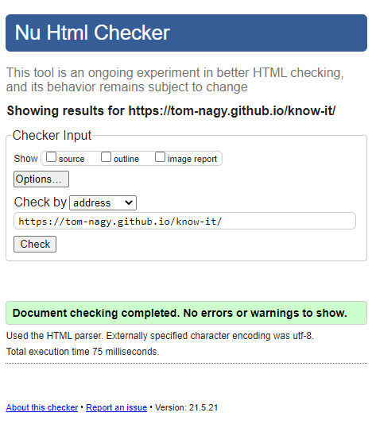

* [W3C CSS Validation Service](https://jigsaw.w3.org/css-validator/)

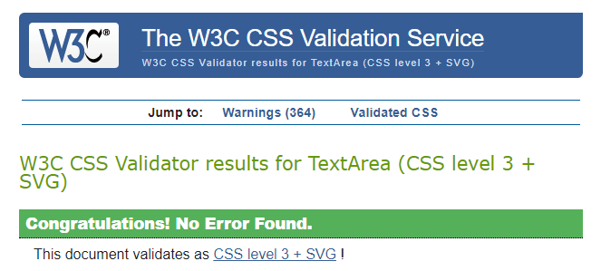

[**:back:** *Table of Content* ](#Table-of-Content)

### JSHint

[JSHint](https://jshint.com/) was used to validate the JavaScript code for semantic and syntax errors. No warnings or error were found.  
The results are positive and the code is valid.

## Lighthouse

[Lighthouse](https://developers.google.com/web/tools/lighthouse/?utm_source=devtools) is a tool provided by Google Chrome DevTools and allows to identify the site performance, accessibility and user experience on Mobile and Desktop.  
All the pages from the website have been tested with Lighthouse.

They all show 100% score except for the performance for most pages. This is due to images sizes mostly and to the css file size. In the future devlopement of the website, considering a separation of the css between the play page and the rest of the website could be beneficial as well as creating different image sizes that would be loaded depending on the screen size.

* Home
  * 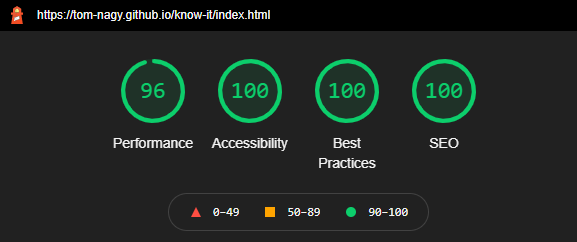
  * 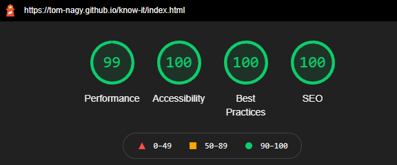
* About
  * 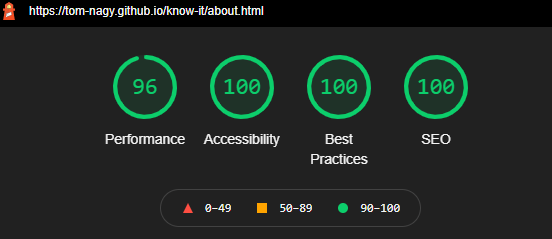
  * 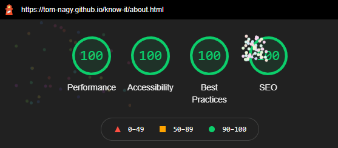
* Study
  * 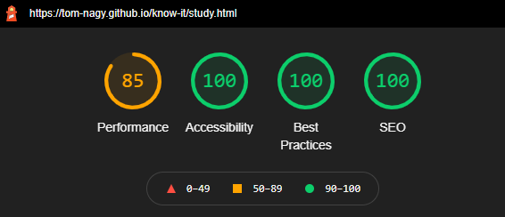
  * 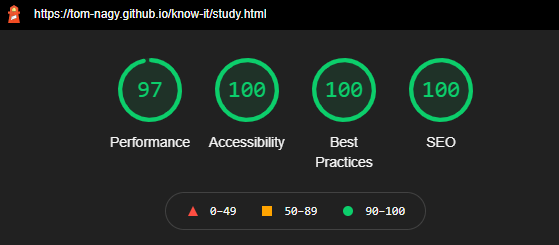
* Play
  * 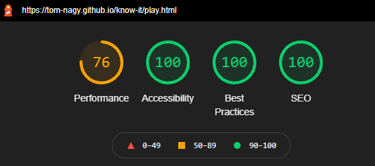
  * 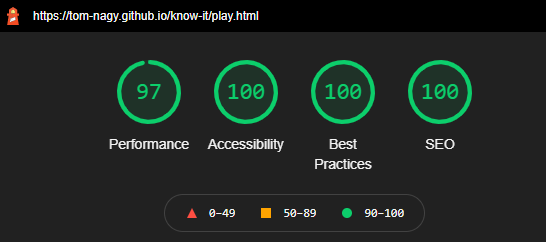
* Contact
  * 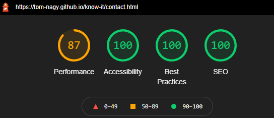
  * 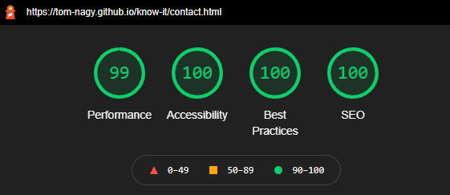
* 404
  * 
  * 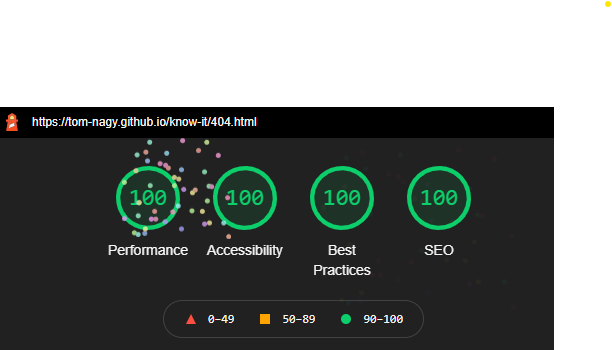

[**:back:** *Table of Content* ](#Table-of-Content)

## Cross Browsers Testing

The website was tested on severals browsers (Google Chrome, Mozilla Firefox, Microsoft Edge, Safari and Opera) and shows good functionality across them all.  
Manual testing was executed on **all browsers** as shown in the following section.

### Manual Testing

The responsiveness of the website for different viewport sizes was tested by dragging the window up, down, left and right.  
The following tests have been executed severals times at different viewport breakpoints.

* Header
  * Click on the website **Logo**, and check if the link works and changes state when hovered and focused.
  * Click on the **menu button** to toggle the menu's links list and check if the button works and changes state when hovered and focused as well as all the links it contains.  

* Footer
  * Click on **the graduation cap icon** link and check if the link works and changes state when hovered, focused and opens in a different tab.
  * Click on **the cogs icon** link and check if the link works, when hovered and changes state focused and opens in a different tab.
  * Click on **the Pinterest icon** link and check if the link works, when hovered and changes state focused and opens in a different tab.

* index.html
  * Click on **About** navigation link (button), and check if the link works and changes state when hovered and focused.
  * Click on **Study** navigation link (button), and check if the link works and changes state when hovered and focused.
  * Click on **Play** navigation link (button), and check if the link works and changes state when hovered and focused.

* about.html
  * Click on **Study** navigation link (button), and check if the link works and changes state when hovered and focused.
  * Click on **Play** navigation link (button), and check if the link works and changes state when hovered and focused.
  * Click on **Contact** navigation link (button), and check if the link works and changes state when hovered and focused.

* study.html
  * Click on **Volcano** icon/button, and check if loads the content and changes state when hovered and focused.
  * Click on **Jungle** icon/button, and check if loads the content and changes state when hovered and focused.
  * Click on **Ocean** icon/button, and check if loads the content and changes state when hovered and focused.
  * Click on **Earth** icon/button, and check if loads the content and changes state when hovered and focused.
  * Click on **Play** navigation link (button), and check if the link works and changes state when hovered and focused.
  * Click on **the magnifiers** navigation link (button) in all the articles, and check if they toggle the content correctly and change state when hovered and focused.

* play.html
  * Click on **Study** navigation link (button), and check if the link works and changes state when hovered and focused.
  * Click on **How to play** button, and check if it toggles the rules and changes state when hovered and focused.
  * Click on **Volcano** icon/button, and check if it changes state when hovered and focused.
  * Click on **Jungle** icon/button, and check if it changes state when hovered and focused.
  * Click on **Ocean** icon/button, and check if it changes state when hovered and focused.
  * Click on **Earth** icon/button, and check if it changes state when hovered and focused.
  * Click on **Set Level** button, and check if it toggles the levels list and it changes state when hovered and focused.
  * Click on **Apprentice** and check if it changes state when hovered and focused and that it popultate the **Set Level** button when selected.
  * Click on **Scientist** and check if it changes state when hovered and focused and that it popultate the **Set Level** button when selected.
  * Click on **Genius** and check if it changes state when hovered and focused and that it popultate the **Set Level** button when selected.
  * Click on **Start** button and check if it works and loads the corresponding game defined by the selected subject and level.
  * Check if a modal pop-up if the settings are not set properly when clicking on **Start**.
  * Check if the achievements are being displayed at the bottom of the page upon receiving them.

* Game
  * Extensively check all the games features:
    * General Display.
    * Subject and level display.
    * New Game and Exit buttons.
    * Directional buttons.
    * Questions modals.
    * Question form when submitting without selection.
    * Answering right answer and getting the correct feedback.
    * Answering wrong answer and getting the correct feedback, displaying the right answer and displaying a strike on the game.
    * Receiving the correct feedback upon completing the game, receiving rewards when finishing with no strikes and getting score.

* contact.html

  * Try to submit the form without :
    * Filling **Your name** input and check if the form is valid and that an error message appears.
    * Filling **Your email address** input and check if the form is valid and that an error message appears.
    * Filling **Your message** input and check if the form is valid and that an error message appears.
    * Selecting a **Reason** and check if the form is valid and that an error message appears.

  * Try to submit the form given incorrect format input for :
    * Email and check if the form is valid and that an error message appears.

  * Send the form and check if :
    * A pop-up appears to give feedback upon submitting the form. One if the submission is successful and another one if it is not.
      * Check if the links available on those pop-ups works and change state when hovered and focused.
    * I reveived an email as a website owner delivered by EmailJS.
    * I received an email confirmation as a user.

  * Hovered and focused on the different input field and the button to check if they change state.

* 404.html
  * Click on **Back to home page** link (button) and check if the link works and changes state when hovered, focused.
  * Click on **What is a 404 error?** link and check if the link works, when hovered and changes state focused and opens in a different tab.
  * Click on **Report an issue** link and check if the link works, when hovered and changes state focused.

* Modals
  * Check if the modals appear and close correctly depending on their functionality.

[**:back:** *Table of Content* ](#Table-of-Content)

### Conclusions and Notations

All the features and functionality works very well across browers except for some features on safary and iOS.

Noted issues on iphones and iOS:

* The **menu button** does not render as intended and is a bit off.
* There are some unnoticeable design difference like the text-decoration of the subject and level on the game.
* Some differences are a bit more obvious and seem to be in relation to positioning, hover and focus effect.
  * The subjects buttons in the Study pages do not change backgound-color when ckicked. This is a positive feedback for the user to know what has been selected.
  * The directional buttons in the game display what i beleive is the focus and/or hover effect in an unexpected way.
  * In the modals, the closing button does not render nicely.

Noted general issue:

* The scrolling on smartphones can be a bit disturbing while on a modal because we can notice from time to time that something is happening in the background.

Although those issues do not change and/or impact on the functionality of the features, they have negative effects on the user experience.

[**:back:** *Table of Content* ](#Table-of-Content)

## User Stories Testing from UX section of the README.md

### First Time User

1. As a first time user, I want the website to be appealing.
    * The website uses clean and spacious design.
    * The website uses playful fonts and colors that gives a friendly and attractive feel.
    * The website applies all the accessibility protocols for an easy and good user experience for all.

See [Lighthouse](https://github.com/Tom-Nagy/walking-around/blob/master/TESTING.md#Lighthouse) for accessibility results.

2. As a first time user, I want the navigation to be easy and intuitive.
    * The navigation menu is easily accessible and recognizable.
    * All the pages present a large and clear title that help users to identify on what page they are.
    * The navigation choice is to provide links to the main website's features on the pages where it is relevant for simplicity and effectiveness.
    * The links network is design not to have the need to use the navigation menu when using the website for its main purpose.
    * On the home page, three links are provided: About, Study and Play.
    * On the study page, a link to the play page is provided.
    * On the play page, a link to the study page is provided.

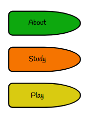

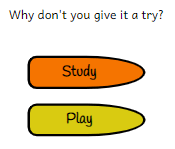

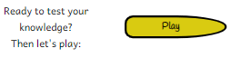

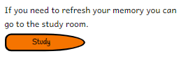

3. As a first time user, I want the content to be informative but not overwhelming.
    * The content is displayed per readable and short sections to provide the feeling that it is approachable and not complicated. This is supported by the website design.
    * The articles in the study section are designed to be attrative and offer a magnifier (button) to toggle more information on the corresponding subject.

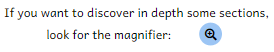

4. As a first time user, I want to understand immediately what is the website about without the need of looking for it.
    * The home page provide all the information that a new user needs:
        * The main heading gives the main information: “Welcome to Know It” which includes a subtitle: “Learning is cool and Knowledge is great!”. This gives information on the website focus which is learning and knowledge.
        * The statement below the heading says: “Here learning is FUN !” which gives the information to the user that the means used to learn and get the knowledge are playful and fun.
        * As well the playfulness of the fonts gives a visual cue.

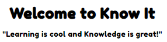

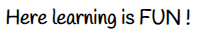

5. As a first time user, I want to be able to choose the subject to study.
    * Information on how to use the study room is displayed at the top of the page.
    * The subjects are presented as clickable icons (buttons) So it is easy to select and change subject.
    * The selected subject is highlighted with a red background and a bigger scale so it is easy to identify.

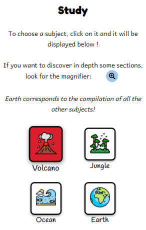

6. As a first time user, I want the content to be interactive.
    * The website design present an interactive feel over the website by using hover and focus effects coupled with buttons for displaying extra content in the study page.

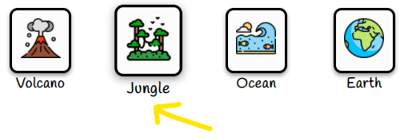

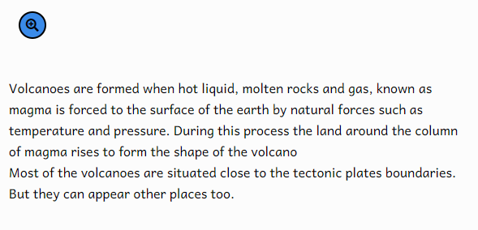

7. As a first time user, I want to play the game.
    * The game is accessible from the first visit and offer three levels with one easy that is accessible to everyone.
    * The easy level is composed of six questions and two strikes are allowed.

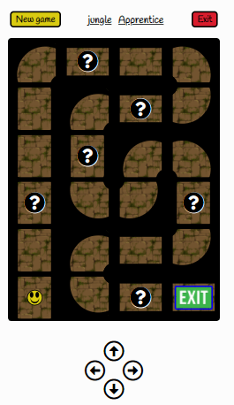

8. As a first time user, I want the gameplay to be easy to understand.
    * The rules are very simple and accessile from the play page just above setting the game.
    * Use the arrows to move the avatar and reach the exit.
    * When on a question, answer it. If right you continue, if wrong you get a strike and continue.
    * Strike(s) limit depends on the level selected.
    * Strikes received are displayed on the screen.

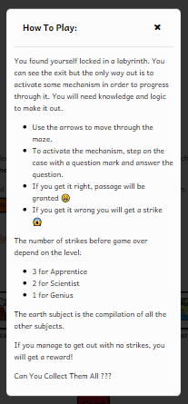

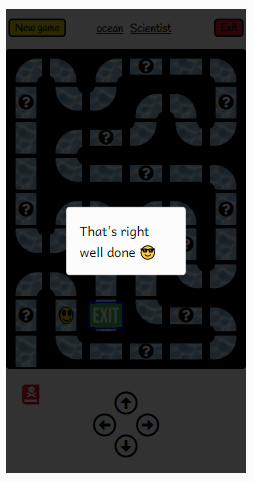

9. As a first time user, I want to be able to choose a difficulty level for the game.
    * Game settings are available and accessible from the play page.

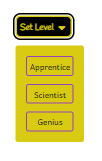

10. As a first time user, I want to be able to choose the subject of the game.
    * Game settings are available and accessible from the play page.

11. As a first time user, I want to keep tract of my gaming score and progress.
    * Results are being displayed upon finishing a labyrinth level.
    * Rewards/Achievements receivde are displayed at the bottom of the play page.

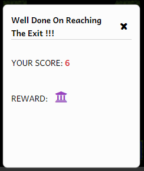

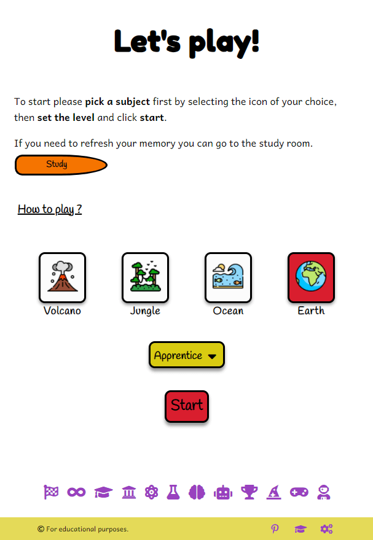

### Returning User

1. As a returning user, I want to improve.
    * There are three different game level with three subjects and an extra subject/difficulty that combines the three others.
    * There is the study page available to browse in order to learn and improve.
    * All the answer of the questions are found in the study content.

2. As a returning user, I want to check the different subjects.
    * The subjects are easy to access and three subjects are available at the moment.

3. As a returning user, I want to challenge myself on the game.
4. As a returning user, I want to earn different achievements playing the game.
    * Different levels are available.
    * Twelve rewards/achievements are available to collect at the moment and provide a goal and motivation to progress in the game and to improve.

5. As a returning user, I want to contact and get information on the website owner.
    * A contact page is available and accessible from the navigation menu and the about page.
    * In the about page a section encourage reaching out for specific request.

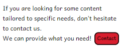

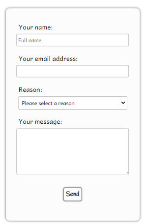

[**:back:** *Table of Content* ](#Table-of-Content)

## Further Testing

* The website has been tested by fellow students, slack community, friends and family.
* All the issues raised have been addressed.

* An issue has appeard on the console when loding the page:

>Error with Permissions-Policy header: Unrecognized feature: 'interest-cohort'.

This message was present during devlopement process and desappeard at some point. And now it is back again. It comes along a 404 erro message that appear briefly with a *robots.txt* file type.  
After reading about this issue, it seems like GitHub pages should have had solved it: [gitbog](https://github.blog/changelog/2021-04-27-github-pages-permissions-policy-interest-cohort-header-added-to-all-pages-sites/).

This warning do not prevent the website from functioning correctly.

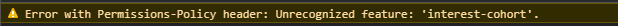

[**:back:** *Table of Content* ](#Table-of-Content)